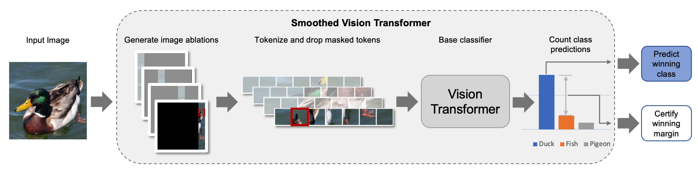

# Certified Patch Robustness via Smoothed Vision Transformers

This repository contains the code for replicating the results of our paper:

**Certified Patch Robustness via Smoothed Vision Transformers** </br>
*Hadi Salman\*, Saachi Jain\*, Eric Wong\*, Aleksander Madry*

Paper: coming soon <br>
Blog post: coming soon <br>

```bibtex
    @InProceedings{salman2021certified,
        title={Certified Patch Robustness via Smoothed Vision Transformers},
        author={Hadi Salman and Saachi Jain and Eric Wong and Aleksander Madry},
        booktitle={ArXiv preprint arXiv:TODO},
        year={2021}
    }
```

<p>

</p>

## Getting started
*Our code relies on the [MadryLab](http://madry-lab.ml/) public [robustness library](https://github.com/MadryLab/robustness), which will be automatically installed when you follow the instructions below.*

1.  Clone our repo: `git clone https://github.mit.edu/hady/smoothed-vit`

2.  Install dependencies:
    ```
    conda create -n smoothvit python=3.8
    conda activate smoothvit
    pip install -r requirements.txt
    ```

## Full pipeline for building smoothed ViTs.

Now, we will walk you through the steps to create a smoothed ViT on the CIFAR-10 dataset. Similar steps can be followed for other datasets.

*The entry point of our code is [main.py](src/main.py) (see the file for a full description of arguments).* 

First we will train the base classifier with ablations as data augmentation. Then we will apply derandomizd smoothing to build a smoothed version of the model which is certifiable robust.

### Training the base classifier

The first step is to train the base classifier (here a ViT-Tiny) with ablations.
  ```
  python src/main.py \
        --dataset cifar10 \
        --data /tmp \
        --arch deit_tiny_patch16_224 \
        --pytorch-pretrained \
        --out-dir OUTDIR \
        --exp-name demo \
        --epochs 30 \
        --lr 0.01 \
        --step-lr 10 \
        --batch-size 128 \
        --weight-decay 5e-4 \
        --adv-train 0 \
        --freeze-level -1 \
        --drop-tokens \
        --cifar-preprocess-type simple224 \
        --ablate-input \
        --ablation-type col \
        --ablation-size 4
  ```
Once training is done, the mode is saved in `OUTDIR/demo/`.

### Certifying the smoothed classifier

Now we are ready to apply derandomized smoothing to obtain certificates for each datapoint against adversarial patches. To do so, simply run: 
  ```
  python src/main.py \
        --dataset cifar10 \
        --data /tmp \
        --arch deit_tiny_patch16_224 \
        --out-dir OUTDIR \
        --exp-name demo \
        --batch-size 128 \
        --adv-train 0 \
        --freeze-level -1 \
        --drop-tokens \
        --cifar-preprocess-type simple224 \
        --resume \
        --eval-only 1 \
        --certify \
        --certify-out-dir OUTDIR_CERT \
        --certify-mode col \
        --certify-ablation-size 4 \
        --certify-patch-size 5
  ```    

This will calculate the standard and certified accuracies of the smoothed model. The results will be dumped into `OUTDIR_CERT/demo/`.

That's it! Now you can replicate all the results of our paper.

# Maintainers

* [Hadi Salman](https://twitter.com/hadisalmanX)
* [Saachi Jain](https://twitter.com/saach_jain)
* [Eric Wong](https://twitter.com/RICEric22) 
* [Aleksander Madry](https://twitter.com/aleks_madry) 

